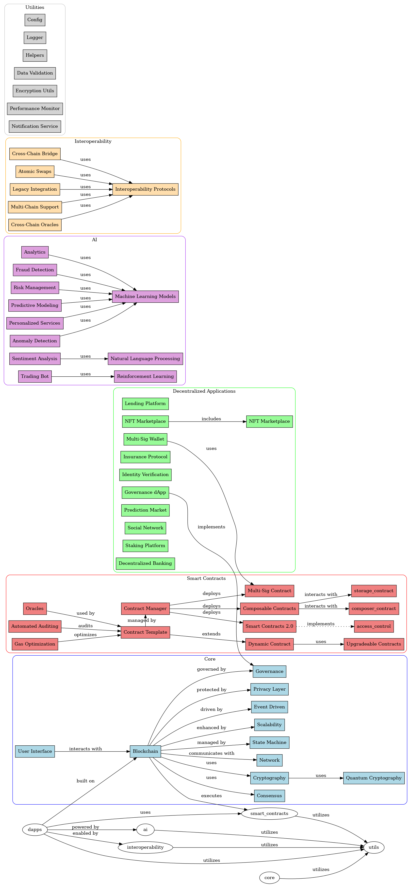

# QuantumVerse-Nexus Architecture

## Overview

The QuantumVerse-Nexus architecture is designed to leverage the capabilities of quantum computing and artificial intelligence to create a robust, scalable, and secure blockchain ecosystem. 

## Components

1. **Core Layer**: Responsible for the fundamental blockchain functionalities, including consensus mechanisms, transaction processing, and cryptographic operations.
2. **Smart Contracts Layer**: Facilitates the creation and execution of self-executing contracts with predefined rules.
3. **Decentralized Applications (dApps)**: User-facing applications built on top of the blockchain, providing various services such as lending, trading, and identity verification.
4. **AI Layer**: Integrates machine learning and AI algorithms for analytics, fraud detection, and personalized services.
5. **Interoperability Layer**: Ensures seamless communication and asset transfer between different blockchain networks.

## Diagram

